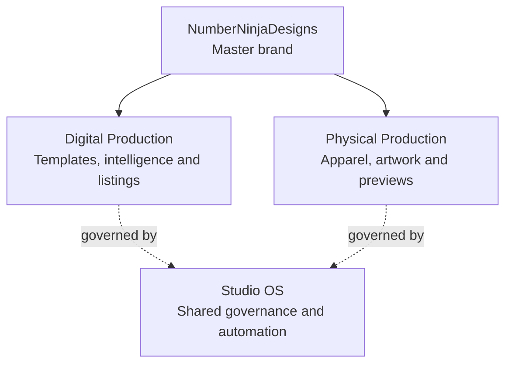

# NumberNinjaDesigns website

Canonical website and operations repository for `NumberNinjaDesigns`. Digital products, physical products and their shared governance live under this single commercial identity.

## Organization



- `Digital Production`: [Etsy Intelligence](modules/etsy-intelligence-engine/), [Listing Intelligence](modules/listing-intelligence-engine/) and digital-product workflows.
- `Physical Production`: storefront, apparel designs, artwork and product previews.
- `Studio OS`: [Control Center](modules/ai-workforce-control-center/) and non-executing governance shared by both production divisions. It is not a separate brand.

Legacy identifiers occur only in migration records, redirect compatibility and cutover validators. They are not active product or organization names.

## Studio OS Phase 9

This repository now includes a non-executing Execution Governance Layer for Studio OS Phase 9. It models approval, risk, rollback readiness, idempotency, and execution policy without adding provider calls, deployments, workers, queues, schedulers, or secret access.

## Studio OS Phase 10

Phase 10 adds a non-executing Execution Readiness Layer on top of Phase 9. It models future execution plans, steps, dependency checks, preflight checks, approval-chain completeness, rollback coverage, idempotency coverage, and readiness decisions. It does not execute workflows, agents, providers, deployments, queues, schedulers, workers, or external mutations.

## Studio OS Phase 12

Phase 12 defines the dashboard/runtime boundary. The local Control Center is a read-only configuration and projection UI; it adds no provider, deployment, queue, scheduler, secret or external mutation capability.

Run validation locally with PowerShell 7:

```powershell
pwsh -File .\scripts\validation\validate-studio-os.ps1
pwsh -File .\scripts\validation\validate-architecture.ps1
pwsh -File .\scripts\validation\validate-execution-contracts.ps1
pwsh -File .\scripts\validation\validate-readiness-contracts.ps1
pwsh -File .\scripts\validation\validate-execution-plans.ps1
pwsh -File .\scripts\validation\validate-preflight-checks.ps1
pwsh -File .\scripts\validation\validate-approval-chains.ps1
pwsh -File .\scripts\validation\validate-readiness-boundaries.ps1
pwsh -File .\scripts\validation\validate-ai-workforce-control-center.ps1
pwsh -File .\tests\ai-workforce-control-center.test.ps1
node .\modules\etsy-intelligence-engine\tests\engine.test.mjs
npm test --prefix .\modules\listing-intelligence-engine
```
