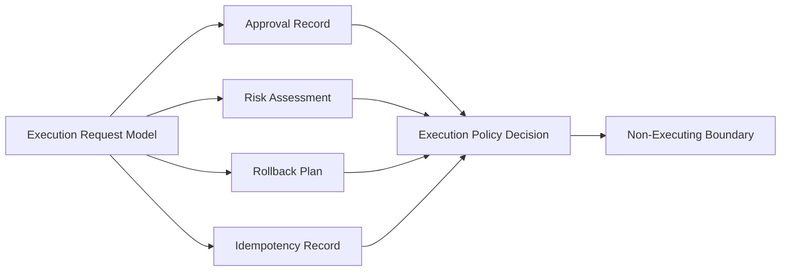

# AI Execution Graph

## Phase 9 State

Phase 9 does not add executable graph edges.

## Boundary

The graph is evaluative only. There is no node that dispatches work, calls providers, deploys code, reads secrets, or mutates external systems.

