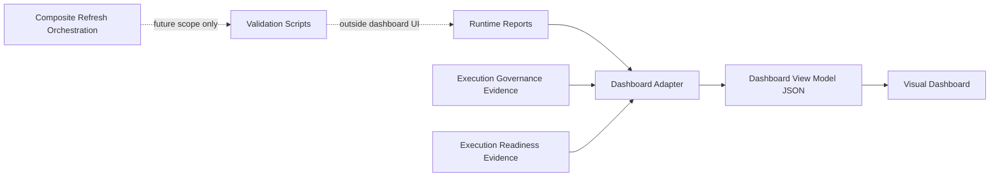

# Dashboard Runtime Boundary

## Purpose

The Studio OS dashboard is a read-only visibility surface. It may display runtime reports, dashboard view models, execution governance evidence, execution readiness evidence, validation status and boundary warnings, but it must never become an execution or mutation surface.

Phase 12 documents this boundary after Phase 11 added the read-only Execution Readiness Dashboard Center. Phase 12 does not add new dashboard UI, runtime execution, providers, deployments, schedulers, workers, queues, secrets, browser storage or autonomous behavior.

## Boundary Model

The dashboard may read existing dashboard JSON and source evidence references. It must not invoke validators, run scripts, refresh runtime state, write decisions, approve actions, execute workflows, call providers or mutate configuration.

## Allowed Dashboard Responsibilities

- Read generated dashboard JSON.
- Render runtime, governance and readiness state.
- Show source file references and timestamps.
- Display validation status, stale-data warnings and boundary warnings.
- Present execution readiness as evidence for human review only.
- Format, filter, group, sort and visually organize already-derived fields.

## Prohibited Dashboard Responsibilities

- Runtime writes.
- Dashboard-originated mutation.
- Provider calls.
- Deployment calls.
- API calls.
- Queue, worker, scheduler, executor, agent or background runner creation.
- Secret, token, API key or credential access.
- Approval mutation.
- Execution-policy mutation.
- Readiness-decision mutation.
- Config mutation.
- Validator execution from UI.
- Validator or business-rule reimplementation.
- `localStorage` or `sessionStorage` persistence for runtime authority.
- Command execution from UI.

## Dashboard Adapter Boundary

The dashboard adapter is a projection layer. It may transform existing runtime reports and governance/readiness evidence into dashboard view model JSON. It must remain read-only toward providers, deployments, credentials, config and source runtime evidence.

The adapter may write dashboard view model output only as derived local runtime output. That output is not authority and cannot grant execution permission.

## Runtime Truth Boundary

Runtime evidence remains the source of truth. Dashboard view models are derived read models. If a dashboard view model disagrees with source runtime evidence, the source evidence wins and the dashboard state must be treated as stale, unknown or invalid.

## Validator Boundary

Validators own validation rules. Dashboard code may display validator output, but it must not re-evaluate approval, rollback, idempotency, risk, preflight, dependency, readiness or execution-policy rules.

Future no-write validation must stay outside dashboard UI and must inspect structure only unless a later approved phase defines stricter contracts.

Phase 13 defines those stricter projection contracts under `shared/contracts/projections/` and keeps no-write validation outside dashboard UI.

## Composite Refresh Boundary

Composite refresh orchestration is not part of Phase 12. A future refresh controller may coordinate validators, report generation and dashboard adapter output only after a separate approved phase defines its contracts, ownership, audit behavior and safety boundary.

Until then:

- No refresh button may run validators.
- No dashboard interaction may write runtime state.
- No UI state may be treated as runtime state.
- No dashboard code may start background work.

## Execution-Readiness Visibility

Readiness display must never imply execution permission.

Required semantics:

- `not executable`
- `readiness evidence only`
- `provider calls disabled`
- `deployment disabled`
- `secret access disabled`
- `human review required`

Forbidden semantics:

- `ready to execute`
- `deployable`
- `approved to run`
- `execution enabled`
- `provider connected`
- `auto-run`
- `auto-deploy`
